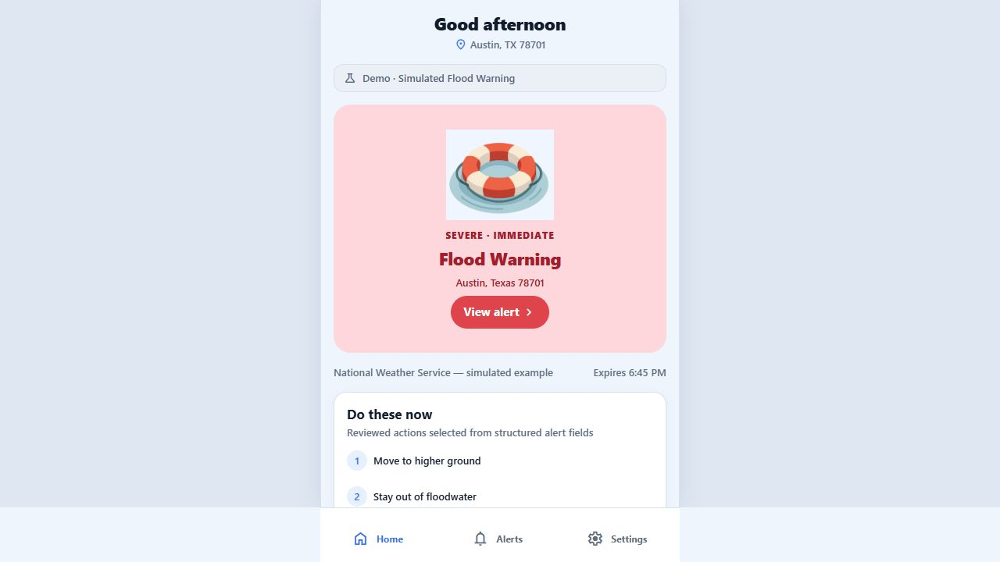
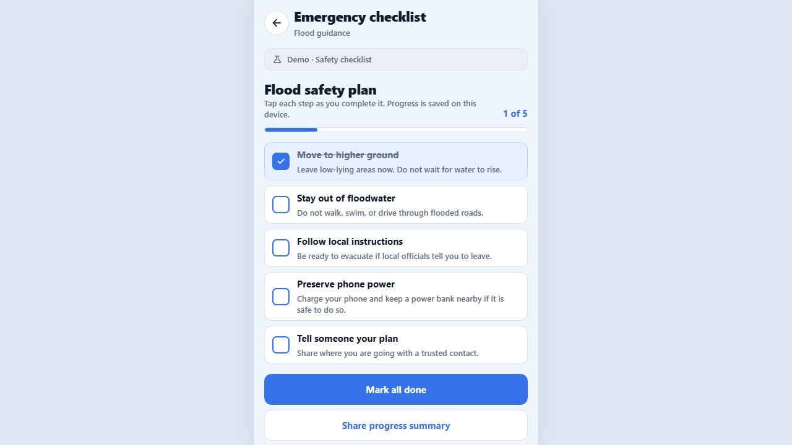
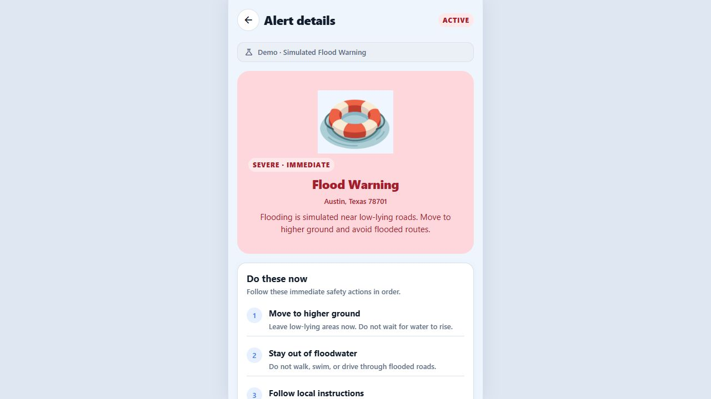
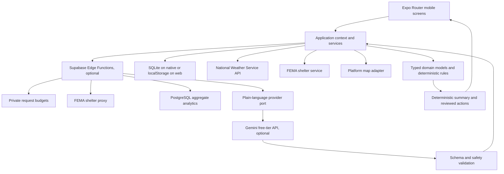

# DisasterReady

DisasterReady is an iPhone-first emergency companion that turns live public alerts into clear, reviewed next steps. It combines National Weather Service warnings, FEMA shelter reporting, deterministic action plans, offline-aware local storage, native map handoff, and an optional safety-constrained plain-language layer.

The primary product target is iOS at approximately 390x844. Android shares the same application and domain code. Web remains a centered mobile demonstration surface for public review.

> Safety note: DisasterReady supports situational awareness. It does not replace instructions from emergency officials, the National Weather Service, FEMA, or 911. Demo alerts are always labeled and never enter native notification rules.

## Product tour

| Live or demo alert | Reviewed action plan | FEMA safety resources |
| --- | --- | --- |
|  |  |  |

- Public web demo: deployment pending. See [deployment instructions](docs/DEPLOYMENT.md).
- Original prototype video: [reference/disastereadyuiux.mp4](reference/disastereadyuiux.mp4)
- Demo path after starting the app: `/home?demo=1`

## Reproducible engineering evidence

| Evaluation | Current result |
| --- | ---: |
| Frozen official NWS replay | 1,000 alerts |
| Production-normalizer completion | 100% |
| Reviewed taxonomy agreement | 100% |
| Eligible alert action-plan coverage | 100% |
| Uncaught replay crashes | 0 |
| Controlled reliability scenarios | 148 of 148 passed |

The NWS corpus, source manifest, SHA-256 digest, machine-readable results, failure accounting, and reproduction commands are committed under [evidence](evidence/) and [the evidence index](docs/evidence/README.md). The recorded CPU latency excludes network, rendering, notification delivery, and user interaction. AI model quality, usability results, expert review, and production adoption remain explicitly pending until real evidence exists.

## What is implemented

- Live point-based NWS active alert retrieval with provider validation and internal normalization
- Clear current, cached, stale, offline, unavailable, active, and expired states
- Reviewed FEMA and Ready.gov action-plan templates selected by deterministic rules
- Checklist progress saved locally without requiring an account
- Native PDF checklist export with a web print and save fallback
- Live FEMA National Shelter System lookup with source, freshness, distance, and status disclosure
- Optional rate-limited FEMA shelter proxy with direct official-source fallback
- Apple Maps handoff on iOS, Google Maps handoff on Android, and a universal web fallback
- Native notification permission adapters and deterministic eligibility and duplicate rules
- Explicit web fallback for native-only notification capability
- Anonymous aggregate analytics with real and demo activity stored as different modes
- Shared client/server analytics validation, server receipt-time reporting, and bounded retention
- Optional server-side plain-language simplification with strict schema and safety checks
- Per-client and global budgets before database, FEMA proxy, or paid AI work
- Deterministic fallback whenever AI is absent, slow, malformed, refused, or safety-invalid
- Accessible labels, large touch targets, app-wide larger text and high-contrast preferences, plain-language summaries, and a centered mobile web shell

## Quick start

Requirements:

- Node.js 22.13 or later, as required by Expo SDK 57
- npm
- A browser for the web demo
- Xcode or Android Studio only when running native builds

```bash
npm install
npx expo start --web
```

Open the localhost URL printed by Expo. Use the simulated flood preview to exercise the full emergency flow without waiting for a live alert.

Optional public backend configuration belongs in a local `.env` file:

```dotenv
EXPO_PUBLIC_SUPABASE_URL=https://YOUR_PROJECT.supabase.co
EXPO_PUBLIC_SUPABASE_PUBLISHABLE_KEY=YOUR_PUBLISHABLE_KEY
```

Copy `.env.example` as a starting point. Never put a Gemini key or Supabase service-role key in an `EXPO_PUBLIC_` variable.

## Commands

```bash
npm run web
npm run build:web
npm run lint
npm run typecheck
npm test
npm run check:style
npm run verify:release
npm run verify:evidence
npm run verify:backend
npm run evidence:nws:collect
npm run evidence:nws:replay -- --strict
npm run evidence:reliability
npm run evidence:ai:prepare
npm run evidence:ai:collect
npm run evidence:ai:score
npm run evidence:usability
```

`npm run check:style` fails when a project-authored text file contains the prohibited Unicode punctuation code point documented in `AGENTS.md`. Third-party, generated, and external reference directories are excluded.

## Architecture



Presentation code depends on application ports, not provider payloads. NWS and FEMA responses are validated and normalized at infrastructure boundaries. Native storage, web storage, notifications, and map behavior are isolated behind adapters. See [the full architecture](docs/ARCHITECTURE.md) and [technical decisions](docs/DECISIONS.md).

## Safety model

Action plans are never generated by a language model. Hazard, severity, urgency, alert status, and reviewed templates determine the actions shown to a user.

When configured, the AI path receives only the official alert text, hazard category, and existing deterministic summary. The Edge Function requires structured JSON, then rejects output that removes a critical phrase, changes a numeric fact or unit, or invents a directive. The client runs the same safety check again. The official alert and original source link always remain available. Gemini free-tier data use is disclosed in the AI safety documentation.

See [AI safety](docs/AI_SAFETY.md), [NWS integration](docs/NWS_INTEGRATION.md), and [safety resources](docs/SAFETY_RESOURCES.md).

## Truthful analytics

Analytics are operational telemetry, not fabricated product traction. Events are anonymous, locally queued, bounded, and delivered only when Supabase is configured. The client and server share event-specific schemas. They reject contact, precise location, postal code, alert text, and arbitrary data. Every event is labeled `real` or `demo`, and reporting uses the server receipt date.

No production totals or user-study outcomes are claimed in this repository. See [the metric glossary](docs/ANALYTICS.md) and [user-testing package](docs/USER_TESTING.md).

Engineering evidence follows the same rule. See [the claim register](docs/evidence/CLAIMS.md) for statements supported now and statements that remain pending.

## Deployment

The web build exports one Expo Router SPA and includes fallbacks for direct routes such as `/alerts`, `/shelters`, and `/alert/:id`. `vercel.json` and `public/_redirects` cover Vercel and Netlify-style hosts.

Supabase and Gemini are optional. Without them, live NWS data, direct FEMA shelter lookup, deterministic action plans, local persistence, maps, and the web demo continue to work. Exact account, key, rate-limit, retention, and verification setup is in [docs/DEPLOYMENT.md](docs/DEPLOYMENT.md).

Use the [release checklist](docs/RELEASE_CHECKLIST.md) for staging, device, user-test, GitHub, and production approval evidence.

## Project history

DisasterReady began as a Congressional App Challenge UI and UX prototype. Creator-provided project context records an honorable mention or fifth-place result. A public citation is still required before presenting that recognition as independently verified. External review details are intentionally not claimed without a source.

The current repository is a ground-up flagship implementation based on that product direction, with live public data, deterministic safety logic, platform adapters, tests, and explicit operational limitations.

## Current limitations

- Live alerts use the saved point rather than polygon-based user geofencing.
- FEMA shelter records are reporting data. A listed status is not a guarantee of space or accessibility.
- Remote push delivery still requires an EAS project, native credentials, device-token registration, and a backend delivery job.
- AI simplification and remote analytics require Supabase deployment and server secrets.
- Anonymous cloud telemetry is schema-validated and rate-limited, but it is not authenticated user evidence.
- No real user-study results or production analytics exist yet.
- The Gemini free-tier key is configured server-side. The full 100-case hosted evaluation still depends on daily free-tier quota availability and completed model outputs.
- Independent expert review and the 30 to 50 participant usability study require real people and cannot be generated from code.
- A public demo URL has not been provisioned.

See [ROADMAP.md](ROADMAP.md) for completed work and credential-gated next steps.

Security boundaries and the current upstream dependency audit are documented in [SECURITY.md](SECURITY.md).
