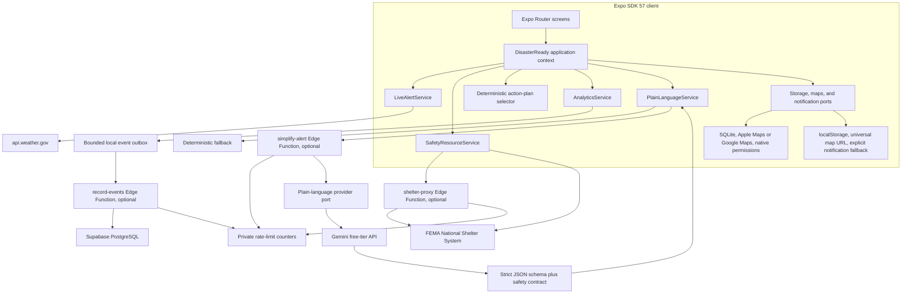
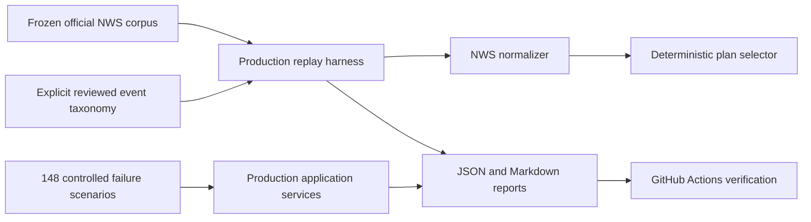

# DisasterReady architecture

## Product boundary

DisasterReady is a mobile application first. The primary reference is an iPhone viewport near 390x844. Android uses the same presentation, application, and domain layers where practical. Desktop web centers the mobile shell and exists as a public demonstration surface, not as a dashboard variant.

## System diagram

## Layer responsibilities

### Presentation

- Expo Router screens and mobile navigation
- Reusable UI primitives and design tokens
- Accessible names, roles, states, and minimum touch targets
- Loading, empty, offline, stale, demo, expired, and error disclosures
- No direct knowledge of NWS, FEMA, Supabase, or Gemini response shapes

### Domain

- Normalized `Alert`, `ActionPlan`, `ActionStep`, `Shelter`, and `UserPreferences` models
- Reviewed action-plan templates
- Deterministic template selection
- Alert freshness and status concepts
- Notification eligibility and duplicate rules

### Application

- Alert retrieval and fallback orchestration
- Shelter retrieval and fallback orchestration
- Checklist and preference workflows
- Anonymous analytics event definitions
- Optional plain-language workflow with deterministic fallback

### Infrastructure

- NWS and FEMA clients, validators, and normalizers
- Native SQLite and browser localStorage adapters
- Platform notification adapters
- Apple Maps, Google Maps, and web routing adapters
- Supabase analytics and plain-language transports
- Optional Supabase shelter proxy with direct FEMA fallback
- Supabase Edge Functions and migration

## Live alert flow

1. The saved location supplies a latitude and longitude point.
2. `NwsAlertClient` requests active alerts for that point with timeout and request throttling.
3. The normalizer rejects malformed features and maps supported hazards into internal models.
4. `LiveAlertService` filters status and hazard preferences, then writes the successful result to the local cache.
5. If live retrieval fails, the service returns saved data with its original retrieval time and a cached or stale label.
6. If neither source exists, the UI says data is unavailable. It does not imply an all-clear.

## Action-plan authority

The deterministic action-plan selector is the safety authority. It uses alert hazard and status to select reviewed, source-linked instructions. The language model does not select, reorder, add, or remove actions.

For optional wording, the application sends the dedicated official NWS instruction when available. The complete official bulletin remains in the alert model and UI. This keeps the model task narrow without hiding source context from the user.

## Optional cloud boundary

Supabase is used only where it adds clear value:

- Store anonymous, aggregate product events after a strict allowlist check
- Keep the Gemini credential off the client
- Apply a schema and safety check before AI wording reaches the app
- Reduce public FEMA CORS and availability risk while preserving a direct public fallback
- Enforce per-client and global request budgets before database or external-provider work

Authentication, profile sync, saved-location sync, and server-side alert mirroring are deliberately not included. Guest access and local emergency readiness do not benefit enough from those dependencies at this stage.

## Data and trust boundaries

Client-safe configuration:

- Supabase project URL
- Supabase publishable key
- Public NWS and FEMA endpoints

Server-only configuration:

- Gemini API key
- Supabase service-role key supplied by the Edge Function environment

The analytics table contains random UUID event and session identifiers, event name, client event time, server receipt time, real or demo mode, and allowlisted aggregate properties. It does not accept contact data, saved coordinates, city, postal code, alert text, or arbitrary event properties. Client roles have no direct access.

## Offline behavior

- Preferences, checklist state, alerts, shelters, and the analytics outbox remain local.
- Alert results older than one hour are stale.
- Shelter results older than 30 minutes are stale.
- Failed cache reads or writes do not turn network failure into an all-clear.
- Analytics and AI failures never block the emergency flow.
- Cold-start evidence exercises cached alert recovery, cached FEMA source and timestamp recovery, stale-state disclosure, and checklist progress after repository restart.

## Evidence architecture

The evidence harness imports the same production normalizers, selectors, services, safety contracts, and repositories used by the app. Controlled adapters supply network, storage, timeout, malformed, and permission-independent conditions.

The corpus manifest stores collection time, exact paginated source URLs, category counts, and a SHA-256 digest. Replaying the frozen corpus does not require external network access. Refreshing the corpus is a separate explicit command so a changing upstream population cannot silently alter a historical result.

## Direct web routes

The Expo web output uses single-page export mode. Hosting rewrites route unknown paths to `index.html`, allowing direct loads of mobile routes. Native-only capabilities expose explicit web fallbacks.
